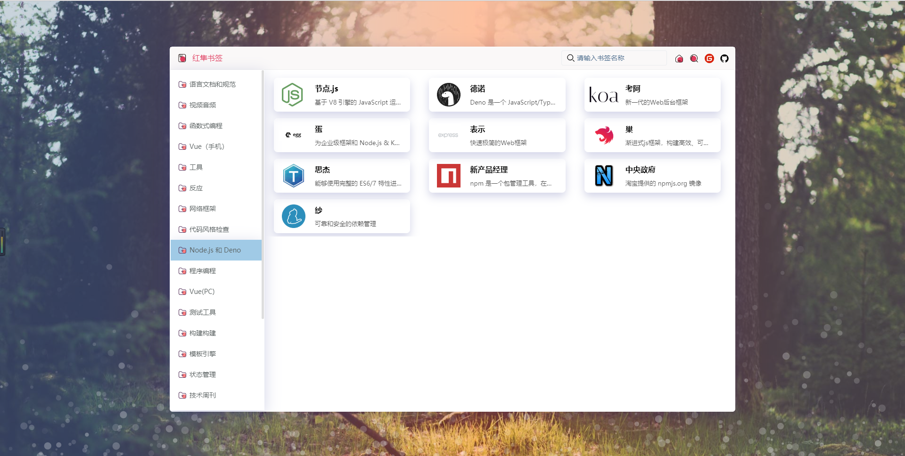
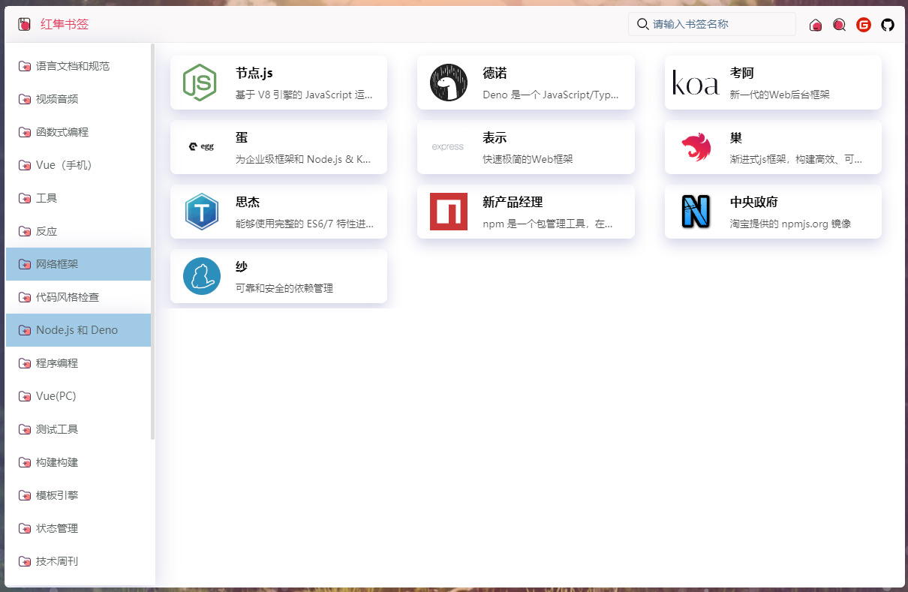

# kestrel-bookmark 红隼书签

#### 介绍
👉👉👉【红隼书签】一款简洁的在线书签导航网站。

网址书签
========
__注意：👉本项目会持续新增功能，但持续维护。如使用中发现问题，请留言或者提交 issue 。谢谢！！！__

## 安装步骤

* 1.克隆项目 https://gitee.com/zhanhongzhu/kestrel-bookmark.git
* 2.进入项目目录 `npm install`
* 3.启动项目`npm run serve`打开浏览器即可 localhost:8080
* 4.打包命令 `npm run build`

## 在线地址
[红隼书签](http://bookmark.zhanhongzhu.top/)

## 效果



#### 源码地址
完全开源，大家可以随意研究，二次开发。当然还是十分欢迎大家点个Star⭐⭐⭐  
👉👉[源码链接(gitee)](https://gitee.com/zhanhongzhu/kestrel-bookmark) &nbsp;&nbsp;&nbsp;&nbsp;&nbsp;&nbsp;👉👉[源码链接(github)](https://github.com/zhanhongzhu/kestrel-bookmark)

## 功能/特色
✅ 1.同步印象中文的web导航数据；可以修改数据；
✅ 2.全局搜索筛选功能；
✅ 3.单页面完成逻辑非常简单，新手小白也能完成二次修改开发；
✅ 4.采用granim插件完成背景动画；可选择更多动画效果；
```js
├── src 
     ├── assets      // 存放静态资源
     │    └──Json    // 静态数据源json数据
     │    └──svg    // 工具栏图标
     ├── APP.vue
     └── main.js
```
## 后续增加功能
* 👉本地离线数据持久化，书签增删改查
* 👉serverless数据，书签增删改查
* 👉背景图片自定义上传
* 👉背景动画效果自定义
* 👉工具栏功能自定义
* 👉导入解析浏览器书签，同步书签数据

  